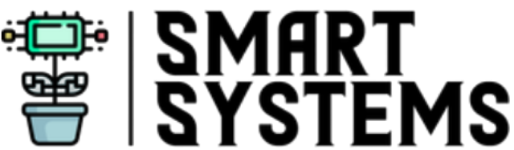

  

<h1 align="center">Smart Systems Lab</h1>

  <strong>Biosystems Engineering Department • Auburn University</strong> 
  350 Mell St, Corley 101, Auburn, AL 36849

  
  

---

## About
We build intelligent systems for agriculture: autonomous field platforms, machine vision pipelines, and data-driven decision tools for growers.

---

## Principal Investigator (PI)
**Dr. Tanzeel Rehman**  
📧 [tur0001@auburn.edu](mailto:tur0001@auburn.edu)

---

## Current PhD Students
- [Hamid Habib Syed](https://github.com/HamidSyed298)  
- [Mohammad Waseem](https://github.com/mzw0147)  
- [Md Hasibur Rahman](https://github.com/hasiburniloy)

## Current MS Students
- [Mohtasim Hadi Rafi](https://github.com/mohtasimhadi)  
- [Faraz Ahmad](https://github.com/its-faraz)  
- [Md Mesbahul Maruf](https://github.com/meshruf)  
- Robert Louie Harris

## Current Undergraduate Students
- Carter Freeman

---

## Alumni
### MS Alumni
- [Md Hasibur Rahman](https://github.com/hasiburniloy) — MS Graduate (now PhD)
---

## Quick Links
- 🔗 Website: **[Smart Systems Lab]([https://your-lab-website.example](https://agsmartsystem.auburn.edu/))**
- 📫 Contact the PI: **[tur0001@auburn.edu](mailto:tur0001@auburn.edu)**

---

  © Smart Systems Lab, Auburn University

